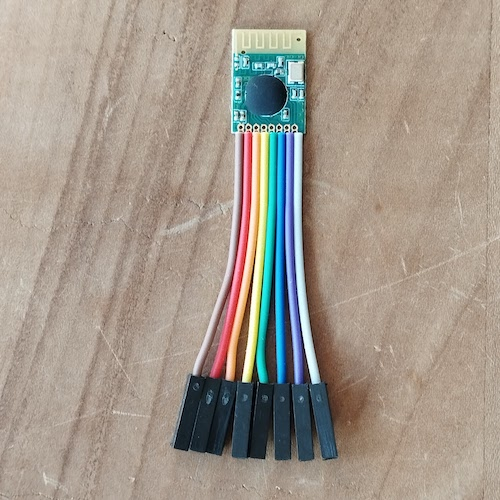
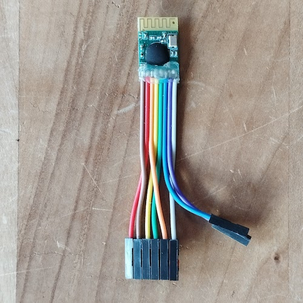

# esphome-cc2500
Texas Instrumants CC2500 Low-Power 2.4 GHz RF Transceiver component for ESPHome.

This CC2500 component for ESPHome controls the CC200 transeiver for sending data to devices using a compatible receiver. Other components that depend on the CC2500 component can reference it. Receiving data is not yet implemented, but is flanned for a future update.

To set up this CC2500 component you first need to place a top-level SPI component which defines the pins to use.

## Hardware required:
- ESP8266, ESP32 or other ESPHome supported microcontroller
- CC2500 transceiver

## Wiring:

|CC2500| ESP8266 |
|:----:|:-------:|
| GND  |    G    |
| VDD  |   3V    |
|  SI  |D7/GPIO13|
| SCLK |D5/GPIO14|
|  SO  |D6/GPIO12|
| GD02 |         |
| GDO0 |         |
| CSn  |D8/GPIO15|





## Configuration variables:
- __cs_pin__ (Required): The pin to use for the chip select of the SPI bus.
- __channel_number__ (Required): The channel signals should be transmitted to.
- __output_power__ (Optional): The output power signals should be transmitted with.

## ESPHome example configuration:
```
esphome:
  name: cc2500

external_components:
  - source: github://rrooggiieerr/esphome-cc2500

esp8266:
  board: nodemcu

# Enable logging
logger:
  level: DEBUG

spi:
  clk_pin: GPIO14
  mosi_pin: GPIO13
  miso_pin: GPIO12

cc2500:
  cs_pin: GPIO15
  output_power: 0xFF
```

## Documentation:
[Texas Instruments CC2500 datasheet](https://www.ti.com/lit/ds/symlink/cc2500.pdf)

## Credits:
[Tor Røttum](https://github.com/torrottum)'s [IKEA Ansluta ESPHome component](https://github.com/torrottum/ikea-ansluta-esphome) was very helpful for making this component.
